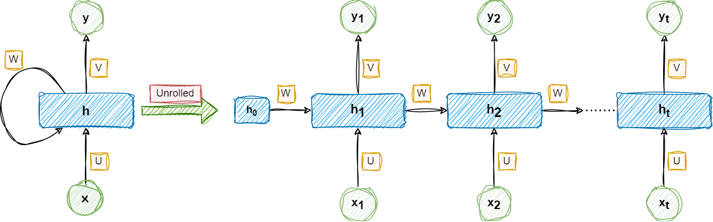
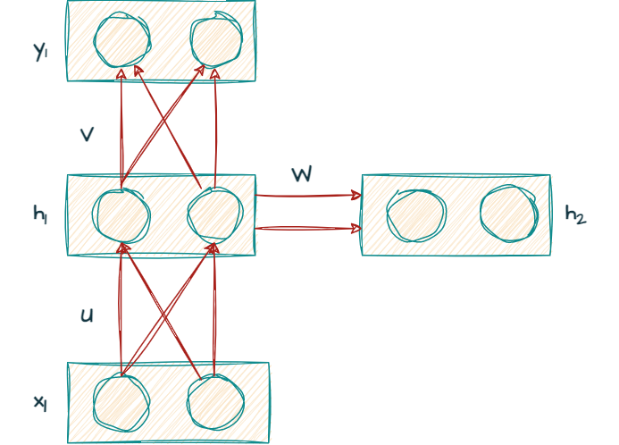

---
author: Nemo
title: Notes on Forward and Back-Propagation in RNNs
date: 2023-01-06
description: 
summary: Notes consisting of the complete derivation of the forward and backpropagation rules in RNN.
aliases: ["/RNN"]
math: true
ShowBreadCrumbs: false
---      
### Recurrent Neural Network(RNN)

RNN Diagram

### Internal Architecture of RNN

 
Internal RNN Architecture


{{ if or .Page.Params.math .Site.Params.math }}

<!-- KaTeX -->
<link rel="stylesheet" href="https://cdn.jsdelivr.net/npm/katex@0.11.1/dist/katex.min.css" integrity="sha384-zB1R0rpPzHqg7Kpt0Aljp8JPLqbXI3bhnPWROx27a9N0Ll6ZP/+DiW/UqRcLbRjq" crossorigin="anonymous">

{{ end }}


### Forward Propagation
&nbsp;&nbsp;In forward propagation, the input data is fed into the RNN in a forward direction to calculate the output at each timestep, for simplicity assume that each timestep is basically a word in a sentence so first timestep would indicate the input of the first word to the network, the input data passed through the input and hidden layer to the output layer where the output is predicted. For that predicted output the loss is calculated with the help of a loss function. Here we assume a few things, first we assume that the activation function in the hidden layer is the tanh(tangent hyperbolic) function and the output activation function is the softmax function. The softmax function gives us the normalized probabilities from the output. The equations for softmax and tanh functions are given below:
- Softmax function 
$$
 \textrm{softmax}({z_i}) = \frac{e^{z_i}}{\sum_{k=1}^{K}e^{z_k}}
$$
- Tanh function 
$$
 \tanh({x}) = \frac{2}{1+e^{-2x}} - 1
$$

The equations for the forward propagation at any time step t are:
$$
 \{h_t} = \tanh(U\{x_t} + W\{h_{t-1}})
$$
$$
 \{y_t} = \textrm{softmax}(V\{h_t})
$$
$$
 \{L_t} = -\{y_t}\log\hat{\{y_t}}
$$
The argument of the softmax function can also be written as 
$$
 \{z_t} = {V{h_t}}
$$
Then the equation becomes
$$
 \{y_t} = \textrm{softmax}(z_t)
$$



The total loss for any given input sequence \(\textrm{x}\) is the summation of all the losses over every time step given by \(\sum_{t=0}^{T}{L_t}\).



### Backpropagation Through Time(BPTT)
*Back-propagation involves propagating the error from the output layer to the input layer. Backpropagation helps reduce the error by adjusting the weights between the layers. In back-propagation we pass the calculated gradients backward through the network in reverse order in order to update the weights of each layer which in fact effects the output of the network. This propagation of the gradients is called backpropagation through time because in RNN we are calculating the gradients w.r.t the current timestep and then passing it to the previous timesteps, this can be evidently seen when deriving the update rules for the weights matrices.* 
*In recurrent neural networks the trainable parameters are the weights U, V and W and hence they need to be updated. The updation of this weights can be done by the following set of equations:*
$$
\{W} = \{W} - \alpha{\frac{\partial L}{\partial W}}
$$
$$
\{V} = \{U} - \alpha{\frac{\partial L}{\partial V}}
$$
$$
\{U} = \{U} - \alpha{\frac{\partial L}{\partial U}}
$$



Here \(\alpha \) is the learning rate.



Now, deriving the update rules for the weights can be in the following way:
#### Update Rules for V
$$
\begin{align}
  {\frac{\partial {L}}{\partial V}} & = {\frac{\partial {L_0}}{\partial V}} + {\frac{\partial {L_1}}{\partial V}} + ... + {\frac{\partial {L_T}}{\partial V}} \\\
  & = \sum_{i=0}^{T}{\frac{\partial {L_i}}{\partial V}} \\\
  \tag{1.1}\label{eq:par_L_V}
  & = \sum_{i=0}^{T}\frac{\partial {L_i}}{\partial {y_i}}\frac{\partial {y_i}}{\partial {z_i}}\frac{\partial {z_i}}{\partial {V}}
\end{align} 
$$

Solving for the first term of \eqref{eq:par_L_V}

$$
\begin{align}
  \frac{\partial {L_i}}{\partial {y_i}} & = \frac{\partial }{\partial {y_i}}{(-\{y_i}\log \hat{y_i})} \\\
  & = -\{y_i}\frac{\partial }{\partial {y_i}}{\log \hat{y_i}}\\\
  & = -\{y_i}\frac{1}{\hat{y_i}} \\\
  \tag{1.2}\label{eq:W}
  & = -\frac{y_i}{\hat{y_i}}
\end{align} 
$$



For solving the second term of \eqref{eq:par_L_V}, we have to break down the partial derivative into two cases: \(\textrm{i} = \textrm{k}\) and \(\textrm{i} \neq \textrm{k}\).


**Case 1:**
$$
\begin{align}
    \frac{\partial {y_i}}{\partial {z_k}} & = \frac{\partial }{\partial {z_k}}(\frac{e^{z_i}}{\sum_{k=1}^{K}e^{s_k}})\\\
    & = \frac{e^{z_i}}{\sum_{k=1}^{K}e^{s_k}} - \{e^{z_i}}\left(\frac{\{e^{z_i}}}{(\sum_{k=1}^{K}e^{s_k})^2}\right) \\\
    & = \frac{e^{z_i}}{\sum_{k=1}^{K}e^{s_k}} - \left(\frac{\{e^{z_i}}}{(\sum_{k=1}^{K}e^{s_k})}\right)^2 \\\
    & = \hat{y_i}\left( 1 - \hat{y_i}\right)
\end{align} 
$$

**Case 2:**
$$
\begin{align}
 \frac{\partial {y_i}}{\partial {z_k}} & = \frac{\partial }{\partial {z_k}}(\frac{e^{z_i}}{\sum_{k=1}^{K}e^{s_k}})\\\
 & = \frac{0 - \{e^{z_i}}\{e^{z_k}}}{(\sum_{k=1}^{K}e^{s_k})^2} \\\
 & = -\hat{y_i}\hat{y_k}
\end{align}
$$

Now,

$$
\begin{align}
  \frac{\partial {L}}{\partial V} & = \sum_{i=0}^{T}\frac{\partial {L_i}}{\partial {y_i}}\frac{\partial {y_i}}{\partial {z_i}}\frac{\partial {z_i}}{\partial {V}} \\\
  \frac{\partial {L}}{\partial V} & = \sum_{i=0}^{T}\frac{\partial {L_i}}{\partial {z_i}}\frac{\partial {z_i}}{\partial {V}} \\\
  \frac{\partial {L_i}}{\partial {z_i}} & = -\frac{y_i}{\hat{y_i}}\begin{cases}
    \hat{y_i}\left( 1 - \hat{y_i}\right), & \text{if $i = k$}.\\\
    -\hat{y_i}\hat{y_k}, & \text{otherwise}.
  \end{cases}\\\
  \tag{1.3}\label{eq:V_cases}
  & = \begin{cases}
    -\{y_i}\left( 1 - \hat{y_i}\right), & \text{if $i = k$}.\\\
    \{y_i}\hat{y_k}, & \text{otherwise}.
  \end{cases}\\\
\end{align}
$$

In order to get a general expression for eqn \eqref{eq:V_cases}, we need to sum for all the K number of classes, hence the equation becomes
$$
\begin{align}
    \frac{\partial {L_i}}{\partial {z_k}} & = -\{y_i} + \{y_i}\hat{y_i} + \sum_{i \neq k}\{y_i}\hat{y_k} \\\
    & = -\{y_k} + \{y_k}\hat{y_k} + \sum_{i \neq k}\{y_i}\hat{y_k} \\\
    & = -\{y_k} + \hat{y_k}\left(\{y_k} + \sum_{i \neq k}{\{y_i}}\right)
\end{align}
$$
The part inside the bracket becomes a sum over all the k classes, therefore 
$$
\begin{align}
    \frac{\partial {L_i}}{\partial {z_k}} & =  -\{y_k} + \hat{y_k}\left(\sum_{i=1}^{k}{\{y_i}}\right) \\\
    & = -\{y_k} + \hat{y_k} \left(\because \sum_{i=1}^{k} = 1\right)
\end{align}
$$

Solving for the third term of \eqref{eq:par_L_V}
$$
\begin{align}
    \frac{\partial {z_i}}{\partial {V}} & = \frac{\partial}{\partial {V}}(V{h_i}) \\\
    & = {h_i}
\end{align}
$$

Subsituiting all these values in eqn \eqref{eq:par_L_V}, we get

$$
\begin{align}
    \frac{\partial {L}}{\partial {V}} & = \sum_{i=0}^{T}(\hat{y_i} - {y_i}) \otimes {h_i}
\end{align}
$$

#### Update rule for W

$$
\begin{align}
  {\frac{\partial {L}}{\partial W}} & = {\frac{\partial {L_0}}{\partial W}} + {\frac{\partial {L_1}}{\partial W}} + ... + {\frac{\partial {L_T}}{\partial W}} \\\
  & = \sum_{i=0}^{T}{\frac{\partial {L_i}}{\partial W}} \\\
  \tag{2.1}\label{eq:par_L_W}
  & = \sum_{i=0}^{T}\frac{\partial {L_i}}{\partial {y_i}}\frac{\partial {y_i}}{\partial {h_i}}\frac{\partial {h_i}}{\partial {W}}
\end{align} 
$$

$$
\begin{align}
  {\frac{\partial {L_1}}{\partial W}} & = \frac{\partial {L_1}}{\partial \hat{y_1}}\frac{\partial \hat{y_1}}{\partial {h_1}}\frac{\partial {h_1}}{\partial {W}}\\\
  \tag{2.2}\label{eq:par_L_2}
  {\frac{\partial {L_2}}{\partial W}} & = \frac{\partial {L_2}}{\partial \hat{y_2}}\frac{\partial \hat{y_2}}{\partial {h_2}}\frac{\partial {h_2}}{\partial {W}}\\\
\end{align} 
$$



The term \({h_2}\) is defined as

\({h_2}\) = \(\tanh(U{x_2} +  W{h_1})\)
  
It can be seen that the term \({h_2}\) is dependent on the previous timestep's hidden state \({h_1}\). 
So, in order compute the partial derivative of the hidden state w.r.t \({W}\) we can split it into two parts - explicit and implicit. The explicit part treats the argument inside the tanh function as a constant while the implicit part moves inside the function and does the derivative of the function. 


$$
{\frac{\partial {h_2}}{\partial W}} = \frac{\partial {h_2^+}}{\partial {W}} + \frac{\partial {h_2}}{\partial {h_1}}\frac{\partial {h_1}}{\partial {W}}
$$
The equation \eqref{eq:par_L_2} can thus be written as
$$
\begin{align}
  {\frac{\partial {L_2}}{\partial W}} & = \frac{\partial {L_2}}{\partial \hat{y_2}}\frac{\partial \hat{y_2}}{\partial {h_2}} \left( \frac{\partial {h_2^+}}{\partial {W}} + \frac{\partial {h_2}}{\partial {h_1}}\frac{\partial {h_1}}{\partial {W}}\right)\\\
  & = \frac{\partial {L_2}}{\partial \hat{y_2}}\frac{\partial \hat{y_2}}{\partial {h_2}}\frac{\partial {h_2^+}}{\partial {W}} + \frac{\partial {L_2}}{\partial \hat{y_2}}\frac{\partial \hat{y_2}}{\partial {h_2}}\frac{\partial {h_2}}{\partial {h_1}}\frac{\partial {h_1}}{\partial {W}}
\end{align} 
$$

Generalizing this equation it becomes,

$$
\begin{align}
  \frac{\partial {L_i}}{\partial {W}} = \sum_{k=1}^{i}\frac{\partial {L_i}}{\partial \hat{y_i}}\frac{\partial \hat{y_i}}{\partial {h_i}}
  \frac{\partial \hat{h_i}}{\partial {h_k}}\frac{\partial \{h_k^+}}{\partial {W}} \\\
  \tag{2.3}\label{eq:par_L_gen}
  \frac{\partial {L}}{\partial {W}} = \sum_{i=1}^{T}\sum_{k=1}^{i}\frac{\partial {L_i}}{\partial \hat{y_i}}\frac{\partial \hat{y_i}}{\partial {h_i}}
  \frac{\partial {h_i}}{\partial {h_k}}\frac{\partial \{h_k^+}}{\partial {W}}
\end{align}
$$



Here, \(\frac{\partial h_i}{\partial h_k}\) is a chain rule within itself i.e. if \(i = 3\) and \(k = 1\), then

\(\frac{\partial h_3}{\partial h_1} = \frac{\partial h_3}{\partial h_2}\frac{\partial h_2}{\partial h_1}\)



Hence the equation \eqref{eq:par_L_gen} becomes

$$
\begin{align}
  \frac{\partial {L}}{\partial {W}} = \sum_{i=1}^{T}\sum_{k=1}^{i}\frac{\partial {L_i}}{\partial \hat{y_i}}\frac{\partial \hat{y_i}}{\partial {h_i}}\left(\prod_{m=k+1}^{i}
  \frac{\partial {h_m}}{\partial {h_{m-1}}}\right)\frac{\partial \{h_k^+}}{\partial {W}}
\end{align}
$$



Now at any point m, we know that \(h_m = \tanh(Ux_m + Wh_{m-1})\) and 

\(\frac{\partial h_m}{\partial h_{m-1}} = W^Tdiag(1-\tanh^2(Ux_m + Wh_{m-1}))\)
 
Also, \(\frac{\partial {L_i}}{\partial \hat{y_i}}\frac{\partial \hat{y_i}}{\partial {h_i}} = \hat{y_i} - {y_i}\) and the explicit derivative is \(\frac{\partial {h_k^+}}{\partial {W}} = {h_{k-1}}\). There the complete equation is:



$$
  \tag{2.4}\label{eq:complete_W}
  \frac{\partial {L}}{\partial {W}} = \sum_{i=1}^{T}\sum_{k=1}^{i}(\hat{y_i} - {y_i})\left(\prod_{m=k+1}^{i}
  W^Tdiag(1-\tanh^2(Ux_m + Wh_{m-1}))\right)\otimes {h_{k-1}}
$$
#### Update rule for U



The update rule for \(U\) can be derived in the same manner as \(W\), the only difference comes in the explicit part of \(U\).The explicit derivative is

\(\frac{\partial {h_k^+}}{\partial {U}} = {x_{k}}\)
 
Hence the complete update rule is:



$$
  \tag{2.5}\label{eq:complete_U}
  \frac{\partial {L}}{\partial {U}} = \sum_{i=1}^{T}\sum_{k=1}^{i}(\hat{y_i} - {y_i})\left(\prod_{m=k+1}^{i}
  W^Tdiag(1-\tanh^2(Ux_m + Wh_{m-1}))\right)\otimes {x_k}
$$

### References
> <cite>[Activation Functions in Neural Networks][1]</cite> 
> <cite>[Recurrent Neural Networks][2]</cite> 
> <cite>[Ahlad Kumar's Playlist][3]</cite> 
> <cite>[RNN from scratch][4]</cite> 

[1]: https://towardsdatascience.com/activation-functions-neural-networks-1cbd9f8d91d6
[2]: https://towardsdatascience.com/recurrent-neural-networks-rnns-3f06d7653a85
[3]:https://www.youtube.com/playlist?list=PLdxQ7SoCLQANQ9fQcJ0wnnTzkFsJHlWEj
[4]: https://github.com/gy910210/rnn-from-scratch