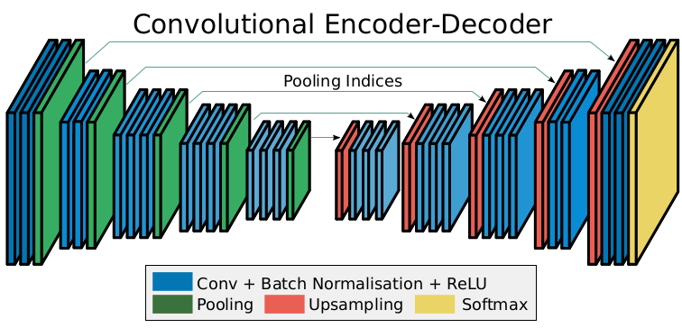
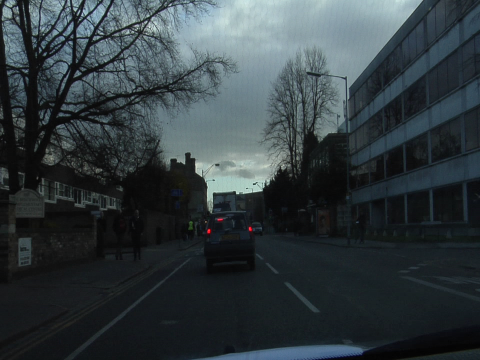
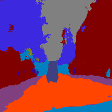

---
author: Nemo
title: Notes on SegNet - A Deep Convolutional Encoder-Decoder Architecture for Image Segmentation
date: 2023-01-31
summary: My Notes on the SegNet semantic segmentation architecture
aliases: ["/SegNet"]
math: true
ShowBreadCrumbs: false
--- 

### Architecture

 

SegNet is deep convolutional neural network which consists of corresponding encoder and decoder for pixel-wise semantic segmentation.
The encoder encodes or downsamples the input images into low resolution feature maps and the
decoder network upsamples these low resolution encoder feature maps into the original resolution
feature maps. It is similar to other architectures such as UNet and DeconvNet, however it differs from
them in some ways. Segnet was designed to be an efficient architecture for
pixel-wise segmentation and was motivated for the use in road scene understanding.

#### Encoder - Decoder Network

&nbsp;&nbsp;The encoder architecture is identical to the convolutional layers in VGG16
architecture. It discards the fully dense connected layers and keeps the 13
convolutional layers. Each encoder block consists of convolutional layers which
produces a set of features maps, a batch normalization layer and a ReLU activation
layer. It is then followed by a max pooling layer. The decoder also has the same 
number of convolutional layers. Each decoder architecture is similar to that of the
encoder and only varies in terms of the upsampling layer.

 In SegNet, downsampling is achieved by using max pooling layers after each encoder
block. It has a pooling window size of 2 with a stride of 2. The model explores the idea of
storing the max-pooling indices in each pooling window for each feature map. The upsampling
layer in each corresponding decoder block upsamples the features maps by using the max-pooling
indices.

#### Output
The output of the final decoder of SegNet is fed into a trainable softmax classifier to predict
the probabilities for the K number of classes. The output is a K channel image where each channel
represents a class.

### How's it different
As stated earlier, SegNet has similarity with DeconvNet and U-Net in terms architecture. As compared to SegNet, DeconvNet requires
more computational resources and is harder to train and in terms of U-Net, it does not reuse pooling indices but instead transfers the entire feature map
to the corresponding decoders and concatenates them to upsampled decoder feature maps.

### Implementation
I have implemented the SegNet architecture in Tensorflow 2 and it can be found
[here](https://github.com/ND15/SegNet-tensorflow-2)

Run the notebook 

### Output Images
| Input | Predicted |
|:---------:|:-------------:|
|        |            |

